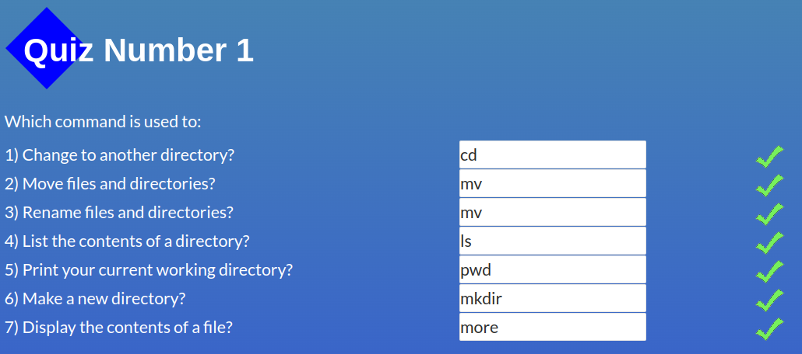
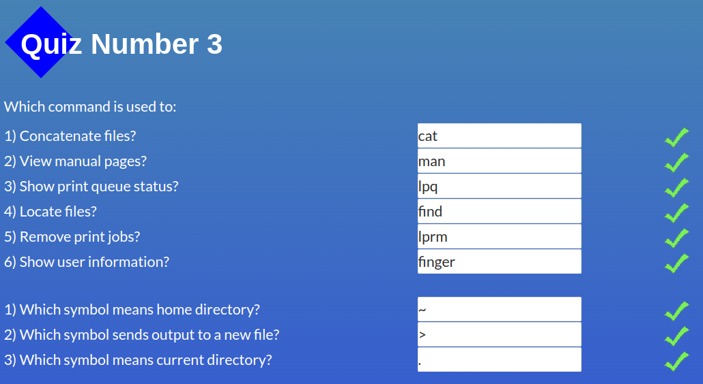
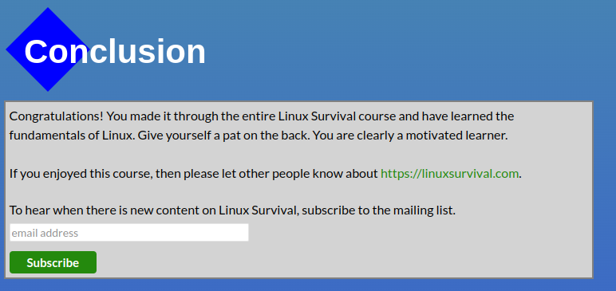

### General

- Git Basics
- Linux CLI, and HTTP
- Git Collaboration
- Intro to HTML and CSS
- Responsive Web Design

## Linux CLI, and HTTP

Screenshots

1. Дуже багато нового та цікавого матеріалу.
2. Дивно чому я до цього не користувался Linux ))
3. Планую і далі використовувати термінал.

## Git Collaboration

Screenshots

## Intro to HTML and CSS

Screenshots

## Responsive Web Design

Screenshots

